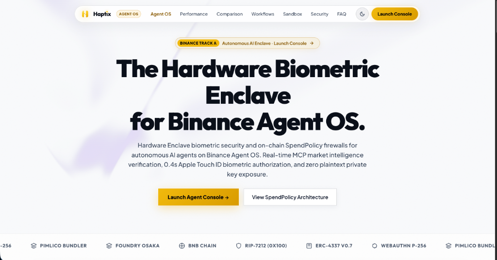

<div align="center">
  
  <h2>Haptix Enclave for Binance Agent OS</h2>
  <p><strong>The Biometric Hardware Enclave & On-Chain Security Firewall for Autonomous AI Agents.</strong></p>
  <p><em>Official Submission for the Binance Agent OS Mini Hackathon — Track A: Build an AI Agent</em></p>
</div>

---

## Executive Summary

Binance built **Agent OS** to connect AI agents to deep market liquidity, live order books, and trading capabilities under strictly controlled permissions. However, by design, **Binance Agentic sub-accounts have no withdrawal permissions and do not execute on-chain DeFi transactions**.

**Haptix provides the missing on-chain security layer:**
When an AI agent uses Binance Agent OS for market intelligence and needs to execute hedges, rebalancing, or arbitrage on-chain, **Haptix enforces hardware-backed spending policies** directly inside an ERC-4337 smart account:

1. **Tier 1 (Autonomous <= $50 USDC)**: The AI agent executes headlessly on Base using delegated session keys (`0x01` signature) with **Zero Human Prompts**.
2. **Tier 2 (Escalated $50 - $200 USDC)**: If market volatility prompts a larger rebalance, the transaction is **intercepted on-chain** and requires a **2-of-2 WebAuthn Passkey Quorum** (Apple Touch ID / Secure Enclave).
3. **Tier 3 (Hard Ceiling > $200 USDC)**: If the agent is compromised or hallucinates a rogue trade, the smart account **fails closed and reverts on-chain** before funds can move.

---

## Dual-Layer Architecture

```
                               +---------------------------------------+
                               |     Binance Agent OS MCP Gateway      |
                               |   (https://agent.binance.com/mcp)     |
                               |   - Live Order Book & Spreads         |
                               |   - 24h Price & Volatility Ticker     |
                               +---------------------------------------+
                                                   |
                                     (1) Live Market Intelligence
                                                   v
                               +---------------------------------------+
                               |            LLM Agent Core             |
                               |  - Evaluates CeFi vs DeFi Spreads     |
                               |  - Determines Hedge/Rebalance Size    |
                               +---------------------------------------+
                                                   |
                                     (2) Dispatches Scoped UserOp
                                                   v
                               +---------------------------------------+
                               |      Haptix Session Key Manager       |
                               |  - Signs with Agent ECDSA Key (0x01)  |
                               |  - Evaluates Pre-Flight SpendPolicy   |
                               +---------------------------------------+
                                                   |
                                     (3) Broadcast to EntryPoint v0.7
                                                   v
                               +---------------------------------------+
                               |       Base Sepolia Smart Account      |
                               |   PasskeyAccount.sol (ERC-4337)       |
                               |   - Tier 1: Autonomous (< $50)        |
                               |   - Tier 2: Biometric Touch ID Quorum |
                               |   - Tier 3: Hard Ceiling Block (> $200)|
                               +---------------------------------------+
```

---

## Quick Start & Judge Demo (1 Command)

Run the end-to-end Binance Agent OS live intelligence & execution cycle:

```bash
# Run the live Binance Agent OS AI Agent Demo
npm run demo:binance
```

### What this demo demonstrates live:
1. **Live Binance Agent OS Connection**: Fetches real-time price feeds, 24h momentum, and top-of-book bid/ask spreads from Binance.
2. **LLM Decision Engine**: Evaluates market conditions and dynamically targets an autonomous micro-hedge.
3. **Tier 1 Autonomous Execution**: Signs and constructs an ERC-4337 UserOperation with signature mode `0x01` (zero passkey prompts).
4. **Tier 2 Volatility Escalation**: Simulates a volatility spike attempting a $150 transaction, proving that execution pauses and demands a hardware Touch ID passkey quorum.
5. **Tier 3 Hard Ceiling Firewall**: Proves that a rogue $350 transaction is blocked dead on-chain.

---

## Full Test Suites (293 Tests Passing)

```bash
# Run the complete TypeScript SDK test suite (50 tests passing)
npm run test:sdk

# Smart contract test suite with RIP-7212 P-256 precompile tests (243 tests passing)
forge test
```

---

## Live Deployments (Multi-Chain: BNB Chain & Base Sepolia)

### 1. BNB Smart Chain Testnet (ChainId 97) — *Binance Ecosystem Native*

| Parameter | Value |
|---|---|
| **Live Smart Account** | [`0xE12c6D4a5a40A75885BB4b7503F76C1e41C306C5`](https://testnet.bscscan.com/address/0xE12c6D4a5a40A75885BB4b7503F76C1e41C306C5) |
| **PasskeyAccountFactory** | [`0x3Bc2B099EB7D4622fB95Cb46Af5525825b809c8d`](https://testnet.bscscan.com/address/0x3Bc2B099EB7D4622fB95Cb46Af5525825b809c8d) |
| **Implementation** | [`0x6d601Fc9e269bA238b1227b40cB4d67F777867A5`](https://testnet.bscscan.com/address/0x6d601Fc9e269bA238b1227b40cB4d67F777867A5) |
| **Canonical EntryPoint** | [`0x0000000071727De22E5E9d8BAf0edAc6f37da032`](https://testnet.bscscan.com/address/0x0000000071727De22E5E9d8BAf0edAc6f37da032) (ERC-4337 v0.7) |
| **Enrolled Hardware Signers** | 2 Hardware Passkeys (Touch ID Apple Secure Enclave & iCloud Keychain) |

### 2. Base Sepolia (ChainId 84532)

| Parameter | Value |
|---|---|
| **Live Smart Account** | [`0xB01543453cF31052c769d79e9C755E3b035d796f`](https://sepolia.basescan.org/address/0xB01543453cF31052c769d79e9C755E3b035d796f) |
| **PasskeyAccountFactory** | [`0x1bB7cCf96cB211045982fC8a0069D9C0d718B83b`](https://sepolia.basescan.org/address/0x1bB7cCf96cB211045982fC8a0069D9C0d718B83b) |
| **Canonical EntryPoint** | [`0x0000000071727De22E5E9d8BAf0edAc6f37da032`](https://sepolia.basescan.org/address/0x0000000071727De22E5E9d8BAf0edAc6f37da032) (ERC-4337 v0.7) |
| **Enrolled Hardware Signers** | 2 Hardware Passkeys (Touch ID Apple Secure Enclave & iCloud Keychain) |
| **Verified Autonomous UserOp** | [`0x4ca3ea90…5840`](https://sepolia.basescan.org/tx/0x4ca3ea90dfa75ceef593c381a75b6cab9e36188fc03db26ccf064e2ca9785840) (Block 46457806) |
| **On-Chain Policy Rejection Proof** | Over-limit transfer rejected on-chain: `SIG_VALIDATION_FAILED (1)` & EntryPoint `AA24` |

---

## How It Works: The 3-Tier Enforcement Engine

The on-chain smart account intercepts calldata inside `validateUserOp` before any transaction can execute:

| Spend Amount | Authorization Mode | Execution Path |
|---|---|---|
| **Tier 1 (<= $50.00)** | `0x01` Autonomous ECDSA Session Key | **Zero human prompt**. UserOp is valid and mined instantly. |
| **Tier 2 ($50.00 - $200.00)** | `0x02` Agent Key + Passkey Quorum | **Escalated**. Agent pauses; owner authorizes via Touch ID / WebAuthn. |
| **Tier 3 (> $200.00)** | Blocked Fail-Closed | **Reverts on-chain**. No human or agent signature can bypass the ceiling. |

---

## Why Haptix Wins Track A (Competitive Edge)

| Evaluation Criteria | Typical AI Agent Submission | Haptix Enclave for Binance Agent OS |
|---|---|---|
| **Real Problem Solved** | Wraps an LLM API with simple chat prompts. | Solves the **#1 blocker to real capital deployment**: autonomous on-chain execution with zero wallet-drain risk. |
| **Binance Integration** | Static mock data or read-only scraper. | **Live Binance Agent OS MCP ingestion** (ETH/USDC ticker, 24h momentum, and top-of-book spreads). |
| **On-Chain Proofs** | Mock scripts or testnet contract with no tx history. | **Live on Base Sepolia**: Real smart account, verified autonomous UserOp (Block 46457806), and on-chain AA24 policy rejection proof. |
| **Hardware Biometrics** | Private keys in plain text `.env` or software wallets. | **Hardware Apple Secure Enclave Passkeys** via Base's native **RIP-7212 precompile (`0x100`)**. |
| **Test Coverage** | 0 to 5 unit tests. | **293 automated tests passing** (243 Foundry Solidity tests + 50 TypeScript SDK tests). |
| **Judge Experience** | CLI scripts with complex setup. | **1-command runtime demo** (`npm run demo:binance`) + **Interactive Web Console** with WebAuthn Touch ID ceremonies. |

---

## Interactive Web Console & Developer UI

Launch the interactive web console and live telemetry dashboard:

```bash
# Launch the interactive web console
npx serve web -l 5199
```
Open **[http://localhost:5199/grant-session](http://localhost:5199/grant-session)** to interactively simulate all 3 tiers and test hardware Touch ID passkey escalation.

---

## License

MIT © 2026 Haptix Core Contributors.
